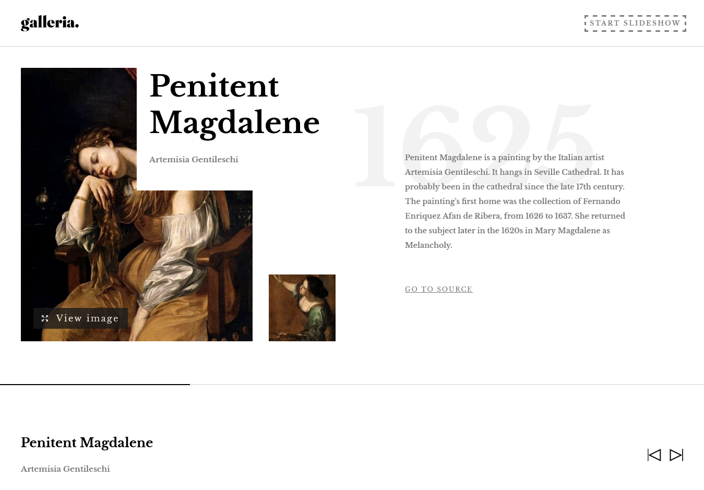

# Frontend Mentor - Galleria slideshow site solution

This is a solution to the [Galleria slideshow site challenge on Frontend Mentor](https://www.frontendmentor.io/challenges/galleria-slideshow-site-tEA4pwsa6). Frontend Mentor challenges help you improve your coding skills by building realistic projects.

## Table of contents

- [Overview](#overview)
  - [The challenge](#the-challenge)
  - [Screenshot](#screenshot)
  - [Links](#links)
- [My process](#my-process)
  - [Built with](#built-with)
  - [What I learned](#what-i-learned)
  - [Continued development](#continued-development)
  - [Useful resources](#useful-resources)
- [Author](#author)
- [Acknowledgments](#acknowledgments)


## Overview

### The challenge

Users should be able to:

- View the optimal layout for the app depending on their device's screen size
- See hover states for all interactive elements on the page
- Navigate the slideshow and view each painting in a lightbox

### Screenshot



### Links

- Solution URL: [Add solution URL here](https://your-solution-url.com)
- Live Site URL: [Galleria slideshow](https://galleria-slideshow-chamu.netlify.app/)

## My process

### Built with

- Semantic HTML5 markup
- CSS custom properties
- Flexbox
- Mobile-first workflow
- [react-responsive-masonry](https://www.npmjs.com/package/react-responsive-masonry) - masonry library
- [React](https://reactjs.org/) - JS library
- [React router](https://reactrouter.com/) - React framework
- [Sass](https://sass-lang.com/) - For styles


### What I learned

Use this section to recap over some of your major learnings while working through this project. Writing these out and providing code samples of areas you want to highlight is a great way to reinforce your own knowledge.

To see how you can add code snippets, see below:

```html
<h1>Some HTML code I'm proud of</h1>
```

```css
.proud-of-this-css {
  color: papayawhip;
}
```

```js
    const targetObj = getOne(id); // use context api to get the target data from the array
    const nextSlide = targetObj.id >= 15 ? 1 : targetObj.id + 1; // for slide navigation.
    // if the last slide has been reached return to first slide otherwise move to the next slide
    const previousSlide = targetObj.id > 1 ? targetObj.id - 1 : null; // for slide navigation as above 
    // but subtract 1 to go back if the current slide is greater than one/
```

```jsx
// using the above js code - navigate by clicking the link button. Value of previousSlide or 
// nextSlide determines the slide/data to be presented
<Link to={`/slides/${previousSlide}`} onClick={handleBackProgressBar}
                            className={`btn btn-back ${previousSlide ? "" : "btn-disabled"}`}

                        >
                            <span className="sr-only">select previous data</span>
                            
                        </Link>
///-------------------------------------------------------------------------------------------///
                        <Link to={`/slides/${nextSlide}`} onClick={handleNextProgressBar}
                            className={`btn btn-next ${nextSlide ? "" : "btn-disabled"}`}
                        >

                            <span className="sr-only">select next data</span>
                            
                        </Link>

```

### Continued development

- react router 6 navigation - letting react router do the heavy lifting

### Useful resources

- [React router 6](https://reactrouter.com/) - navigation between pages


## Author

- Website - [Chamu Mutezva](https://github.com/ChamuMutezva)
- Frontend Mentor - [@ChamuMutezva](https://www.frontendmentor.io/profile/ChamuMutezva)
- Twitter - [@ChamuMutezva](https://twitter.com/ChamuMutezva)


## Acknowledgments

- Github - [Dan Chif](https://github.com/nadchif)

Using Reactrouter was a bit tricky - the navigation had a bug as the data and the navigation bar was not 
in sync. Realised that some of the work that i was writing code for could actually utilize Reactrouter
in built functionalities.